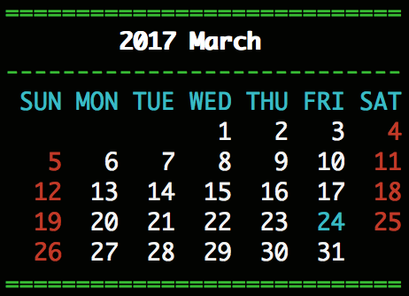

## Calendar -- A nice looking callendar for consoles



### Quick start
```
git clone https://github.com/peter0749/Just-For-Fun --branch Calendar
cd Just-For-Fun/Calendar
make install
today
```

> Note: Original executable today, calendar and calendar2 from /usr/local/bin WILL BE OVERWRITTEN. Install with caution.

### How to get the source code
```
git clone https://github.com/peter0749/Just-For-Fun --branch Calendar
```

### How to install
`make install`

### How to compile?
`make`

### How to use?
For calendar:

```
Usage:  ./calendar year month [width]
        ./calendar --help to print help.
```

For today:

```
today
```
Will show today's calendar.
